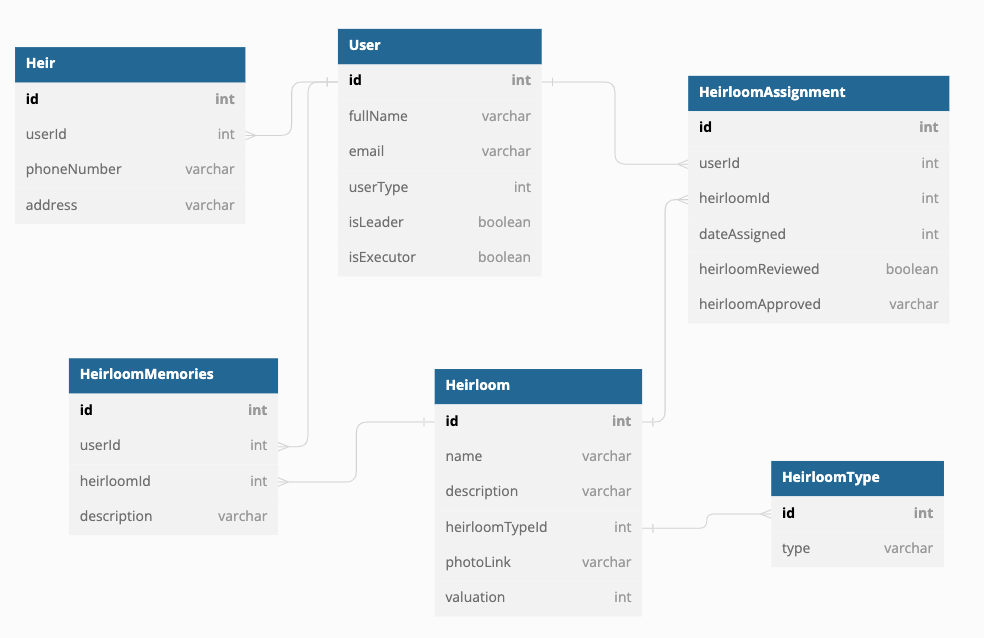
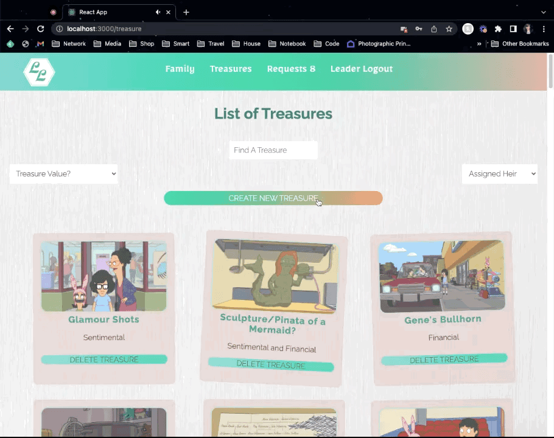

# The Living Legend

__A place to inventory prized possessions and the memories that make them priceless.__

### Why Create This Application?

One part estate planning tool, one part family scrapbook, The Living Legend is designed to help families talk about both the heavy and light of family relationships during the creation of a will or trust. This site is designed to make the difficult process of legacy planning for the future easier by cataloging family heirlooms for the next generation, while creating new memories that families can enjoy in the present.

The initial build of this application was completed in two weeks, using React and CSS for styling. My goals were to incorporate full CRUD functionality, engage different user views, and gain a deeper understanding of React Hooks, props, and state. I also wanted to build a fun and functional user interface without using bootstrapped components, and make sure to bring in mobile-friendly elements.

### Features
* Users can register as an Heir User to view heirlooms as well as add new heirlooms or update information about current heirlooms.
* Users have the ability to filter heirlooms based on their value, whether they have been assigned to the current user, or by searching name or description.
* Users can request items are assigned to them, and admins can provide approval or denial of requests.
* Users can add stories and share photos and videos of hierlooms
* In addition to having access to all the Heir User features, Family Leaders (Admins) can approve requests, change user status to become a Family Leader, or delete user profiles.

### Future Features
* Notably, Heirs can only view their own assignments - they cannot see what heirlooms are earmarked for other users. The next updated will include an Executor status that can be set by Family Leaders, who will have permissions to view all heirloom assignments.

### Technologies used

       

### ERD

### Examples
##### Login/Registration

##### Adding an Heirloom

##### Heir Filters

##### Adding Memories

##### Approving Heirloom Requests

##### User Views

##### Mobile-Friendly Navbar

##### User Management

### Created by Jessalynn Whyte

 
